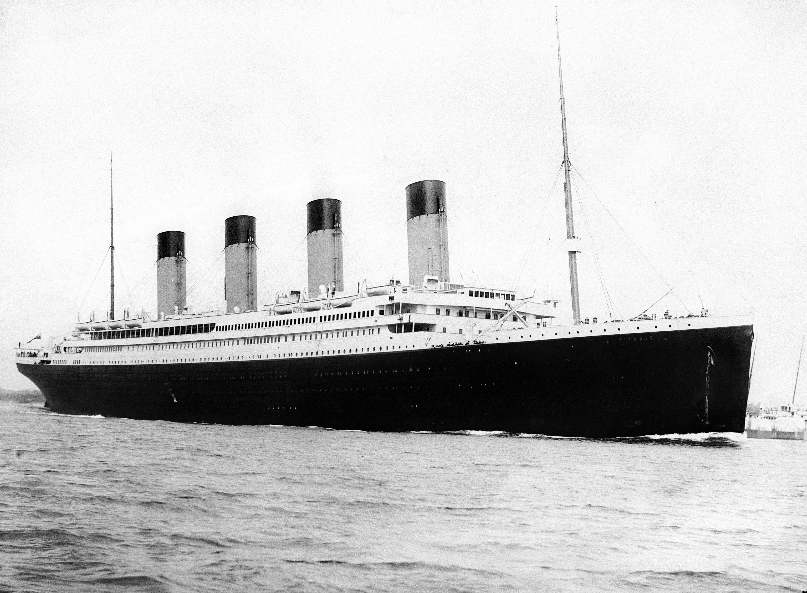
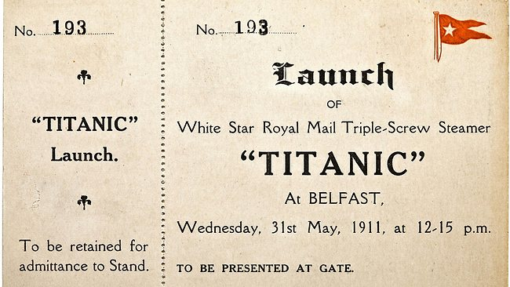

# The Titanic

##Dates for your diary

Though thought of in 1907, the Titanic was not made until the 31st of March, 1909 in Belfast, Ireland. The construction of the Titanic went on for 3 years, ending on the 31st of May, 1911. The Titanic was supposedly indestructible, Setting sail on Wednesday the 10th of April 1912, from Southampton. 

##The Iceberg
 
The iceberg was a [growler](http://www.athropolis.com/arctic-facts/fact-bergy-bits.htm), mostly submerged underwater. It was 50 to 100 feet in height, 200 to 400 feet in length. The iceberg hit the Titanic, in the North Atlantic, on the right hand side near the engine. The Titanic was 450 miles from New York when the iceberg hit her.

##The passengers

There are varied thoughts about how many people the iceberg killed. Here are a few:

1. 886
 
2. 713

3. 706

We also don't know for certain how many people there were on board at the time. Some of the guesses are: 2,229, 2,223, 1,300 people aboard the Titanic.1,517 (or so) died.

Some of the most noted and famous passengers were:

1. John Jacob Astor (The richest man at the time)

2. Ida & Isidor Straus (co-owner of Macy's building in New York)

3. Harper Sleeper

4. Molly Brown

There were approximately 128/112 children on the titanic. About 56 of these children survived (50%), the other 56 or so died.

1. 324 women survived (75%) 110 died.

2. 323 men survived (19%) 1357 died.

3. 703 staff survived (23%) 1526 died.

4.  37% of the passengers survived (not including staff).  
  
5.  32% of the people on board the Titanic survived.
